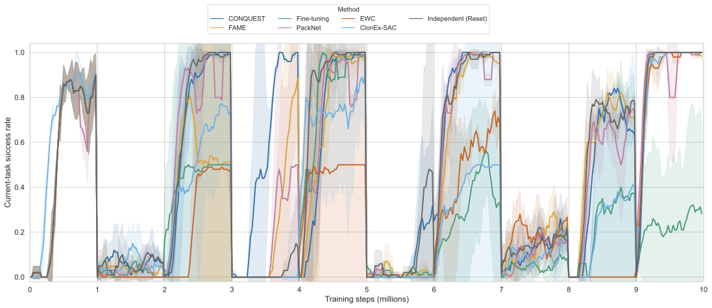
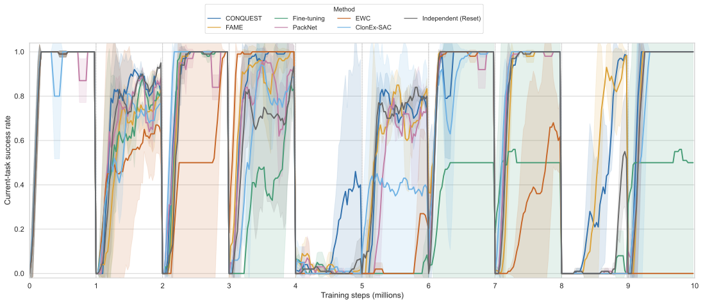
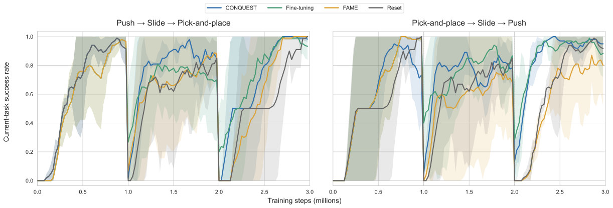
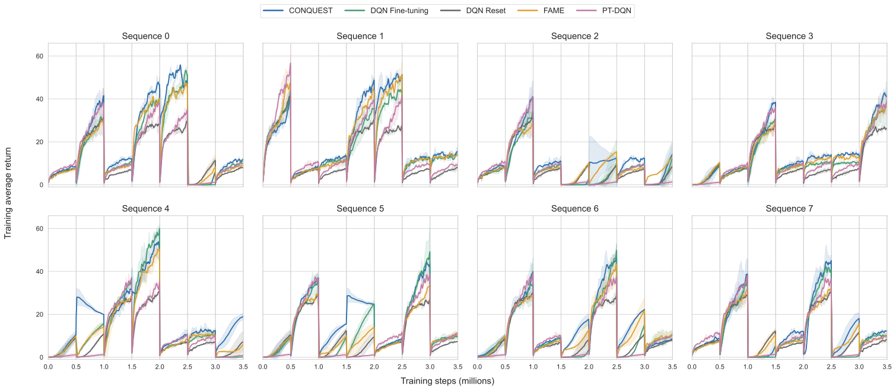

# CONQUEST

This repository contains the CONQUEST continual reinforcement-learning
implementations for Meta-World, Fetch, and MinAtar. Each benchmark trains an
online policy on the current task and consolidates experience into a
goal-conditioned quasimetric model that transfers reusable behavior to later
tasks.

## Training cycle

CONQUEST alternates between fast task learning and slower cross-task
consolidation:

1. The fast policy interacts with the current task and learns from a local
	 replay buffer.
2. At a task boundary, recent task experience is added to task-aware memory and
	 used to update the quasimetric structure.
3. A transferable policy is trained from the quasimetric values with
	 advantage-weighted regression and behavior cloning.
4. On the next task, the transferred policy initializes or regularizes the fast
	 learner during an initial warm-up period. Online learning then continues on
	 the new task.

The implementation is adapted to each action space:

| Benchmark | Fast learner | Cross-task policy | Transfer mechanism |
| --- | --- | --- | --- |
| Meta-World | Task-specific SAC | Observation-conditioned quasimetric AWR actor | actor distillation at each task boundary |
| Fetch | Shared or task-specific online QRL student | Quasimetric meta actor | Automatic fast/meta/random selection followed by KL |
| MinAtar | DQN trained on the current replay buffer | Discrete goal-conditioned quasimetric policy | Teacher distillation during the first steps of each new task |

Use a separate Python environment for each benchmark because their dependency
files are pinned independently:

```bash
python -m pip install -r Metaworld/requirements.txt
python -m pip install -r Fetch/quasimetric-rl/requirements.txt
python -m pip install -r MinAtar/requirements.txt
```

## Meta-World training

The Meta-World curve uses `metaworld_sequence_set12`, a ten-task stream:

```text
plate-slide-back-side-v2 -> soccer-v2 -> sweep-into-v2 ->
handle-pull-side-v2 -> plate-slide-side-v2 -> peg-unplug-side-v2 ->
door-lock-v2 -> reach-v2 -> plate-slide-back-v2 -> coffee-button-v2
```

The plotted configuration trains for 1,000,000 environment steps per task
(10,000,000 total), collects 10,000 random warm-up steps per task, evaluates
every 25,000 steps over 10 episodes, and uses a SAC batch size of 256 with
discount 0.99. At each boundary it retains 20 recent trajectories, updates the
quasimetric/meta actor with 100 updates per stored trajectory and completed
task, and distills the meta actor into the next task actor.

Run four training seeds from the repository root:

```bash
cd Metaworld
for seed in 0 1 2 3; do
	python conquest.py \
		--env metaworld_sequence_set12 \
		--method buffer \
		--seed "$seed" \
		--gpu 0 \
		--change_freq 1000000 \
		--random_steps 10000 \
		--store_traj_num 20 \
		--meta_updates_per_traj 100 \
		--new_task_init warmup \
		--save_freq 25000 \
		--log_backends tensorboard \
		--save_path "results/conquest/set12_seed${seed}"
done
```

Important defaults are `awr_beta=1.0`, `awr_num_goals=4`,
`awr_weight_clip=20`, and a 256-dimensional quasimetric latent space with eight
MRN components. Pass `--meta_update_steps N` to replace the boundary update
schedule with a fixed number of updates.

## Fetch training

The Fetch figure compares the following three-task streams:

- `push -> slide -> pick-and-place`
- `pick-and-place -> slide -> push`

Each task receives 1,000,000 environment steps, so each run contains 3,000,000
steps. The default fast learner is a shared online QRL student. Training starts
with 10,000 random steps per task, uses a batch size of 256, and evaluates every
25,000 steps over 10 episodes. At each boundary, 20 recent trajectories are
merged into the quasimetric memory and the meta learner receives 10,000 updates.
The automatic selector compares the fast, meta, and random candidates over 10
episodes. When the meta policy is selected, it regularizes the fast policy with
KL loss for the first 50,000 steps (`lambda_reg=1.0`).

Run the two task orders and four training seeds from the repository root:

```bash
cd Fetch/quasimetric-rl
for seed in 0 1 2 3; do
	for order in push,slide,pick-and-place pick-and-place,slide,push; do
		./online_continual/run_fetch_continual.sh \
			--env fetch_sequence_custom \
			--task_order "$order" \
			--seed "$seed" \
			--gpu 0 \
			--change_freq 1000000 \
			--random_steps 10000 \
			--store_traj_num 20 \
			--meta_update_steps 10000 \
			--student_mode shared \
			--task_switch_selection auto \
			--warmup_steps 50000 \
			--distill_loss_type kl \
			--distill_goal_source current_replay \
			--save_freq 25000 \
			--log_backends tensorboard
	done
done
```

Runs, CSV metrics, replay snapshots, and fast/meta checkpoints are written under
`Fetch/quasimetric-rl/online_continual/results/cqrl/`. See
[`Fetch/README.md`](Fetch/README.md) for checkpoint evaluation and zero-shot
evaluation commands.

## MinAtar training

The MinAtar experiment evaluates sequence indices 0 through 7. Every sequence
contains seven tasks drawn from Breakout, Space Invaders, and Freeway. A run
lasts 3,500,000 steps and changes task every 500,000 steps.

The fast learner uses DQN with batch size 64, replay capacity 100,000, learning
rate `1e-5`, discount 0.99, epsilon 0.1, and a target-network update every 1,000
steps. After every task, CONQUEST performs 2,000 quasimetric structure updates
and 2,000 shared-policy extraction updates. The launcher uses extraction batch
size 256, 32 goals per transition, AWR temperature 2.0, maximum weight 20,
learning rate `3e-4`, behavior-cloning coefficient 0.2, and a 25% pure-BC
warm-up. The transferred teacher regularizes the DQN for the first 50,000 steps
of each later task. Shared-policy evaluation uses 30 episodes of at most 300
steps per completed task.

Run the eight sequences and four training seeds from the repository root:

```bash
cd MinAtar
./run_conquest.sh \
	--seqs "0 1 2 3 4 5 6 7" \
	--seeds "0 1 2 3" \
	--gpu 0 \
	--wandb-mode online \
	--output-dir results/conquest
```

Use `--wandb-mode disabled` for local runs without Weights & Biases. The launcher
saves return arrays, stage evaluations, and model checkpoints in
`MinAtar/results/conquest/`.

## Training curves

All curves below report the mean over four training seeds; shaded bands show one
standard deviation. Click a figure to open its vector PDF.

### Meta-World set12

[](./metaworld_set12_training_curve.pdf)

*Meta-World sequence set12 current-task success during training. Lines show the
mean over four training seeds and shaded bands show the standard deviation.*

### Meta-World set6

[](./metaworld_set6_training_curve.pdf)

*Meta-World sequence set6 current-task success during training. Lines show the
mean over four training seeds and shaded bands show the standard deviation.*

### Fetch

[](./fetch_training_curve.pdf)

*Fetch fast-policy current-task success during training under the two task
orders. Lines show the mean over four training seeds and shaded bands show the
standard deviation.*

### MinAtar

[](./minatar_8seqs_training_curve.pdf)

*MinAtar training average return across eight task sequences. Lines show the
mean over four training seeds and shaded bands show the standard deviation.*
